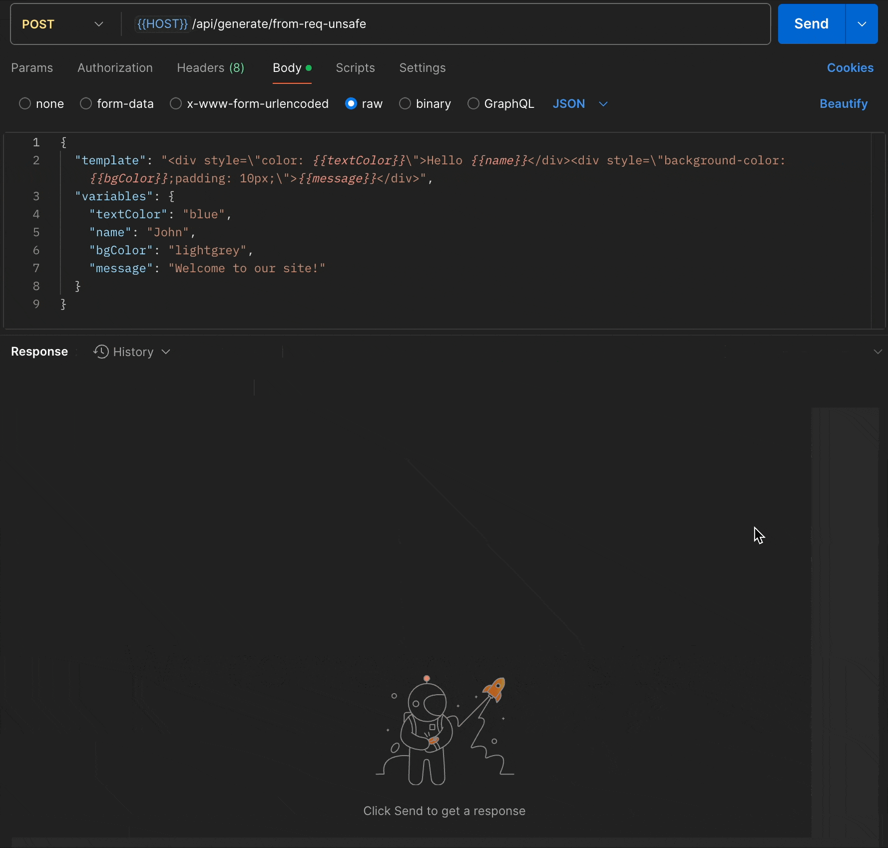

# Eink-SSR-InfoDisplay-Demo-Server

<div align="center">
  
</div>


## Init
```bash
cd backend
npm install
```

## Run Examples


### Example 1: Generate Image from Liquid Template and Variables Defined in Request
- Run
    ```bash
    npm run demo:templateAndVariablesInRequest
    ```
- Endpoint accessible at: POST `http://localhost:3000/`
    - ⚠️ JSON Payload Required ⚠️
        - Examples requests can be found in `../examples/templateAndVariablesInRequest/exampleReqToDemoServer`

### Example 2: Generate Image from Liquid Template and Variables Defined on Server
- Run
    ```bash
    npm run demo:exampleCalendarEvent
    ```
- Endpoint accessible at: GET `http://localhost:3000/`

